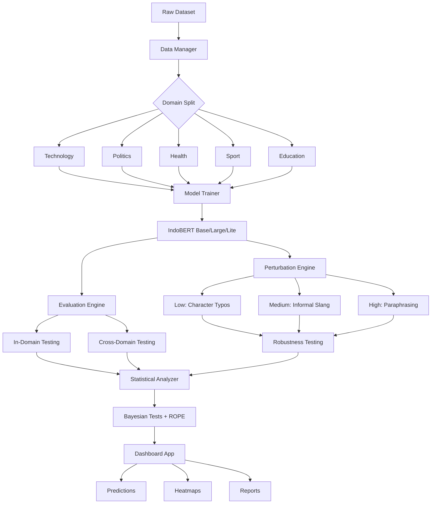

# Robustness Evaluation of IndoBERT for Cross-Domain Indonesian Clickbait Detection

**Authors:** Grace Esther Simanjuntak, Angela Valerie Christy, Khansa Nabilah Awali  
**Institution:** BINUS University, Jakarta, Indonesia

## Overview

This repository provides a comprehensive robustness evaluation framework for Indonesian clickbait detection using IndoBERT model variants. The system systematically assesses model performance under domain shifts and linguistic perturbations, offering scientifically rigorous insights into model reliability for real-world deployment.

## Key Features

- **Multi-Model Support:** Fine-tune IndoBERT base, large, and lite variants with optimized hyperparameters
- **Cross-Domain Testing:** 5×5 evaluation matrix across Technology, Politics, Health, Sport, and Education domains
- **Perturbation Analysis:** Three-level stress testing (character typos, informal slang, syntactic paraphrasing)
- **Statistical Validation:** Bayesian significance testing with ROPE analysis for robust conclusions
- **Interactive Dashboard:** Streamlit interface for real-time predictions, heatmaps, and automated reports

## Project Structure

```
domain-shift-trustworthy-ai/
├── dataset/                     # Data files and documentation
│   ├── Dataset-description.md   # Dataset specifications
│   ├── dataset_eda.ipynb        # Exploratory data analysis
│   └── scrap.py                 # Data collection utilities
├── src/                         # Core system modules
│   ├── 01_data_manager.py       # Data loading and preprocessing
│   ├── 02_model_trainer.py      # Model training and optimization
│   ├── 03_perturbation_engine.py # Text perturbation generator
│   ├── 04_evaluation_engine.py   # Performance evaluation
│   ├── 05_statistical_analyzer.py # Bayesian statistical tests
│   ├── 06_dashboard_app.py      # Interactive web interface
│   ├── config.py                # System configuration
│   ├── train_pipeline.py        # Training orchestration
│   ├── evaluate_pipeline.py     # Evaluation orchestration
│   └── utils.py                 # Helper functions
├── requirements.txt             # Python dependencies
├── run_complete_pipeline.ipynb  # End-to-end execution notebook
└── README.md                    # This file
```

## System Workflow



## Technology Stack

**Core Frameworks:** PyTorch, Hugging Face Transformers, Streamlit  
**Data Processing:** Pandas, NumPy, Scikit-learn  
**Statistical Analysis:** SciPy, Baycomp  
**Visualization:** Plotly

## Installation

### Prerequisites
- Python 3.8+
- CUDA-compatible GPU (recommended for training)

### Setup Instructions

1. **Clone the repository:**
```bash
git clone https://github.com/gredss/domain-shift-trustworthy-ai
cd domain-shift-trustworthy-ai
```

2. **Install dependencies:**
```bash
pip install -r requirements.txt
```

3. **Configure system parameters:**
Edit `src/config.py` to customize model variants, hyperparameters, and evaluation settings.

## Usage

### Training Models
Execute the training pipeline to fine-tune IndoBERT variants:
```bash
python src/train_pipeline.py
```

### Running Evaluations
Perform comprehensive robustness evaluation:
```bash
python src/evaluate_pipeline.py
```

### Launching Dashboard
Start the interactive visualization interface:
```bash
streamlit run src/06_dashboard_app.py
```

### Complete Pipeline
Run the entire workflow using the Jupyter notebook:
```bash
jupyter notebook run_complete_pipeline.ipynb
```

## System Modules

| Module | Purpose |
|--------|---------|
| **Data Manager** | Handles data loading, validation, stratified splitting, and tokenization |
| **Model Trainer** | Manages training loops, hyperparameter optimization, and checkpoint saving |
| **Perturbation Engine** | Generates character-level, lexical, and syntactic text perturbations |
| **Evaluation Engine** | Computes metrics and orchestrates cross-domain testing scenarios |
| **Statistical Analyzer** | Performs Bayesian tests, calculates Source/Target Drop metrics |
| **Dashboard App** | Provides interactive UI for predictions, visualizations, and reports |

## Evaluation Metrics

- **Standard Metrics:** Accuracy, Precision, Recall, F1-Score
- **Robustness Metrics:** Source Drop, Target Drop, Performance Degradation
- **Statistical Tests:** Bayesian Signed-Rank, ROPE Analysis, Credible Intervals

## License

See `LICENSE` file for details.

## Citation

If you use this system in your research, please cite:
```
TBA
```
