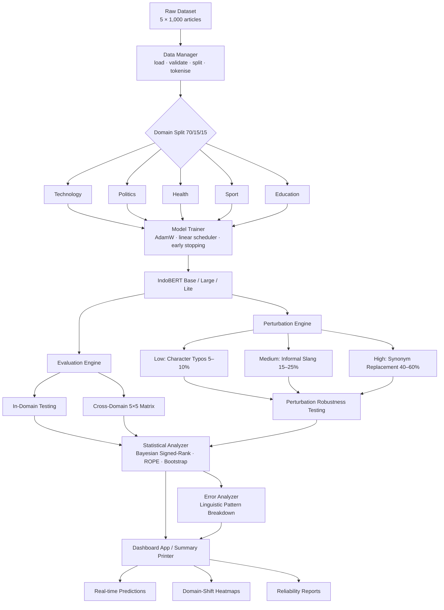

# Robustness Evaluation of IndoBERT for Cross-Domain Indonesian Clickbait Detection

**Authors:** Grace Esther Simanjuntak, Angela Valerie Christy, Khansa Nabilah Awali  
**Institution:** BINUS University, Jakarta, Indonesia

## Overview

This repository provides a robustness evaluation framework for Indonesian clickbait detection using IndoBERT model variants. The system fine-tunes IndoBERT on a domain-split dataset, then assesses performance under cross-domain conditions and linguistic perturbations using Bayesian statistical tests.

## Key Features

- **Multi-Model Support:** Fine-tune and compare IndoBERT base, large, and lite variants
- **Cross-Domain Evaluation:** 5×5 matrix across Technology, Politics, Health, Sport, and Education domains
- **Perturbation Testing:** Three-level stress testing — character typos (low), informal slang injection (medium), synonym replacement (high)
- **Error Analysis:** Linguistic pattern breakdown explaining *why* performance drops (sensational wording, numerical claims, rhetorical questions, named entities, domain jargon)
- **Statistical Validation:** Bayesian signed-rank test with ROPE analysis, bootstrap confidence intervals, and paired/non-parametric significance tests
- **Interactive Dashboard:** Streamlit interface for real-time predictions, cross-domain heatmaps, degradation curves, and automated reliability reports

## Project Structure

```
domain-shift-trustworthy-ai/
├── dataset/
│   ├── data/                        # Per-domain CSV files
│   │   ├── technology.csv
│   │   ├── politic.csv
│   │   ├── health.csv
│   │   ├── sport.csv
│   │   └── education.csv
│   ├── Dataset-description.md       # Dataset specifications and annotation details
│   ├── dataset_eda.ipynb            # Exploratory data analysis notebook
│   └── scrap.py                     # Web scraping utilities
├── src/                             # Core system modules
│   ├── config.py                    # Centralised configuration (models, training, paths, etc.)
│   ├── data_manager.py              # Data loading, validation, stratified splitting, tokenisation
│   ├── model_trainer.py             # Training loop, hyperparameter grid search, checkpoint saving
│   ├── perturbation_engine.py       # Three-level text perturbation generator
│   ├── evaluation_engine.py         # Metrics calculation and cross-domain evaluation orchestration
│   ├── statistical_analyzer.py      # Bayesian tests, ROPE analysis, bootstrap CI
│   ├── error_analyzer.py            # Linguistic error pattern analysis for misclassifications
│   ├── print_evaluation_summary.py  # Pretty-print evaluation results to console / plots
│   ├── dashboard_app.py             # Interactive Streamlit dashboard
│   ├── train_pipeline.py            # Training orchestration script (CLI)
│   ├── evaluate_pipeline.py         # Evaluation orchestration script (CLI)
│   ├── utils.py                     # Shared helper functions
│   └── test_suite.py                # End-to-end unit/integration tests (no GPU required)
├── requirements.txt
├── run_complete_pipeline.ipynb      # End-to-end execution notebook
└── README.md
```

## System Workflow



## Dataset

5,000 Indonesian news headlines scraped from CNN Indonesia, Kompas, Detik, Tempo, and Tribun News (2022–2026). Each domain (Technology, Politics, Health, Sport, Education) contributes 1,000 articles. Headlines are labelled `clickbait` / `non-clickbait` by three independent annotators with majority voting (Fleiss' κ = 0.72, observed agreement 87%).

CSV schema: `id`, `source`, `date`, `title`, `Label`, `url`

See [`dataset/Dataset-description.md`](dataset/Dataset-description.md) for full annotation guidelines and quality criteria.

## Technology Stack

| Category | Libraries |
|---|---|
| Model / Training | PyTorch, Hugging Face Transformers |
| Data Processing | Pandas, NumPy, scikit-learn |
| Statistical Analysis | SciPy (Wilcoxon, Mann-Whitney U, paired t-test), custom Bayesian signed-rank |
| Visualisation / Dashboard | Streamlit, Plotly |
| Utilities | tqdm |

> **Note:** `baycomp` is **not** a dependency. Bayesian analysis is implemented directly in [`src/statistical_analyzer.py`](src/statistical_analyzer.py).

## Installation

### Prerequisites

- Python 3.8+
- CUDA-compatible GPU (recommended for training; evaluation can run on CPU)

### Setup

```bash
git clone https://github.com/gredss/domain-shift-trustworthy-ai
cd domain-shift-trustworthy-ai
pip install -r requirements.txt
```

Edit [`src/config.py`](src/config.py) to change model variants, hyperparameters, or output paths.

## Usage

### Train a model

```bash
# Single model (base / large / lite)
python src/train_pipeline.py --model base

# All three variants
python src/train_pipeline.py --model all

# With hyperparameter grid search
python src/train_pipeline.py --model base --grid-search

# On Colab / GPU
python src/train_pipeline.py --model base --device cuda
```

### Run evaluation

```bash
# Evaluate single model
python src/evaluate_pipeline.py --model base

# Evaluate all models
python src/evaluate_pipeline.py --model all

# Skip perturbation testing (faster)
python src/evaluate_pipeline.py --model base --skip-perturbation
```

### Launch the dashboard

```bash
streamlit run src/dashboard_app.py
```

### Full end-to-end notebook

```bash
jupyter notebook run_complete_pipeline.ipynb
```

### Run tests (no GPU needed)

```bash
cd src
python -m pytest test_suite.py -v
```

## Module Reference

| Module | Responsibility |
|---|---|
| `config.py` | Single source of truth for all hyperparameters, paths, and thresholds |
| `data_manager.py` | Loads per-domain CSVs, validates schema, stratified train/val/test split (70/15/15), tokenises with IndoBERT tokeniser |
| `model_trainer.py` | Fine-tunes `BertForSequenceClassification`, AdamW + linear warmup scheduler, optional grid search, checkpoint saving |
| `perturbation_engine.py` | Applies low / medium / high perturbations via independent seeded random streams |
| `evaluation_engine.py` | Computes accuracy, precision, recall, F1, MCC, ROC-AUC; orchestrates in-domain, cross-domain, and perturbation scenarios |
| `statistical_analyzer.py` | Bayesian signed-rank test, ROPE analysis, bootstrap CI, Wilcoxon, Mann-Whitney U, Cohen's d |
| `error_analyzer.py` | Identifies linguistic patterns in misclassified headlines (sensational wording, numerical claims, rhetorical questions, named entities, domain jargon) |
| `print_evaluation_summary.py` | Console pretty-printer and matplotlib plots for evaluation results |
| `dashboard_app.py` | Streamlit UI: single-text prediction, 5×5 heatmap, degradation curves, automated reliability report |
| `train_pipeline.py` | CLI wrapper for end-to-end training |
| `evaluate_pipeline.py` | CLI wrapper for end-to-end evaluation |
| `utils.py` | Shared helper functions |
| `test_suite.py` | Mocked unit/integration tests covering all modules without GPU or model downloads |

## Evaluation Metrics

- **Classification:** Accuracy, Precision, Recall, F1-Score, MCC, ROC-AUC
- **Robustness:** Source Drop (SD), Target Drop (TD), Performance Degradation across perturbation levels
- **Statistical:** Bayesian signed-rank with ROPE (threshold = 0.01), bootstrap 95% CI, Wilcoxon signed-rank, Mann-Whitney U, paired t-test, Cohen's d effect size

## License

See [`LICENSE`](LICENSE) for details.

## Citation

If you use this system in your research, please cite:

```
TBA
```
